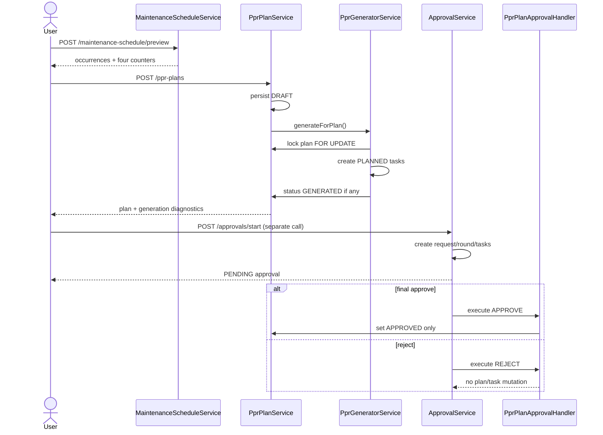

# Backend and Business-Flow Audit: Annual Maintenance and Parallel Approval

**Audit date:** 2026-07-27
**Repository:** `/home/tenzorsoft/Desktop/TOIR/toir-backend`
**Branch/HEAD at final inspection:** `Codex_org` / `04a33770`
**Feature references:** annual `01e48355`; parallel approval `bada6b1f`; eligibility options `8cc1f17b`

> This is a source-, migration-, test-, and history-inspection report. No runtime result is claimed. Status vocabulary: `IMPLEMENTED`, `PARTIAL`, `MISSING`, `CONTRADICTORY`, `BLOCKED`, `LEGACY`, `DEAD_PATH`, `BACKEND_ONLY`, `UNKNOWN`.

## 1. Audit Scope

The audit independently traced Annual Maintenance / Yearly PPR Schedule and sequential/parallel approval from HTTP entry points through services, repositories, entities, migrations, notifications, locks, and test evidence. The frontend audit was used only for contract-context comparison.

Excluded by instruction: application execution, API calls, database queries, migration execution, Maven/Gradle, compilation, and automated tests. The only file created by this audit is this report.

## 2. Repository State and Relevant Commits

- Initial and final branch: `Codex_org`.
- Initial/final HEAD: `04a33770 docs: add frontend audit and modal design`; `origin/Codex_org` was also `04a33770`.
- Initial working tree: clean.
- `8cc1f17b feat: filter maintenance schedule options`: added `/maintenance-schedule/options`, `MaintenanceScheduleOption`, the shared eligibility selector, service/controller wiring, and tests.
- `bada6b1f feat: add parallel approval flows`: added flow/round/template snapshots, parallel decisions, My Tasks, migration, DTO counters/actions, and tests.
- `01e48355 fix: harden maintenance schedule generation`: tightened annual preview/generation, plan locking, occurrence signatures, and lifecycle tests.
- Earlier annual chain: `f2f75f3f` task generation, `acabf880` visibility, `43dd33c7` schedule service.

The pre-audit docs commit is outside this audit’s changes. No commit or push was performed during this audit.

## 3. Executive Summary

Annual schedule preview and eligibility are coherent source-level implementations. The options and preview paths share the same `MaintenanceScheduleEligibilitySelector`; preview returns detailed occurrence items but only four aggregate summary counters. The actual plan lifecycle contradicts the requested business sequence:

`create DRAFT -> synchronous task generation -> GENERATED -> separate approval start -> APPROVED`.

`PprPlanService.create()` always invokes `PprGeneratorService.generateForPlan()` inside the same transaction (`PprPlanService.java:456-484`). Task generation is allowed only in `DRAFT`/`GENERATED`, while approval finalization only changes plan status (`PprPlanService.java:529-559`; `PprPlanApprovalHandler.java:25-37`). Therefore the backend cannot support chief-engineer review before task generation for non-empty schedules and cannot generate PPR tasks only after approval.

Parallel first-round mechanics are substantially implemented: immutable runtime step copies, explicit-user parallel templates, all tasks pending at start, per-assignee decisions, mandatory rejection comment, peer cancellation, request-row locking, single finalization, progress counters, and notification fan-out. It is not a fully closed business flow because requester exclusion is not enforced for generic/PPR parallel templates, notifications carry neither task ID nor round, and concurrency evidence is mostly unit-level rather than a dedicated parallel database integration suite.

Approval resubmission is technically implemented as a new `ApprovalRequest` with `MAX(approval_round)+1`. For PPR it is only partial: rejection leaves the plan and already generated tasks unchanged; a `GENERATED` plan cannot be edited, so “reject -> correct -> resubmit” is blocked.

**Recommendation:** No-Go for end-to-end annual sign-off; Conditional Go for targeted parallel first-round manual testing with DB/API evidence.

## 4. Annual Maintenance Domain Model

| Element | Actual source contract | Classification | Business impact |
| --- | --- | --- | --- |
| `PprPlan` | Code, dates, `PlanStatus`, department, approver, schedule/scope fields, nullable `anchorMode`, tasks/targets (`entity/PprPlan.java:18-80`) | IMPLEMENTED | Nullable anchor preserves legacy behavior. No plan revision/approval-scope field. |
| Plan statuses | `DRAFT, GENERATED, APPROVED, IN_PROGRESS, CLOSED, CANCELLED` (`PlanStatus.java:3-4`) | PARTIAL | `CLOSED` and plan-level `CANCELLED` have no discovered transition endpoint. |
| `PprTask` | Unique code; plan; rule/regulation/equipment; cycle key; scheduled/due dates; status (`PprTask.java:18-70`) | IMPLEMENTED | No DB occurrence-signature columns/constraint. |
| Task statuses | `PLANNED, APPROVED, IN_PROGRESS, COMPLETED, OVERDUE, POSTPONED, CANCELLED` (`PprTaskStatus.java:3-4`) | PARTIAL | `OVERDUE` has no explicit transition in audited service. |
| Builder anchor | `CURRENT` or `RESET_TO_PLAN_START`; null is allowed (`V20260727_1...sql:1-9`) | IMPLEMENTED/LEGACY | Null routes to fixed/legacy generator. |
| Targets | Equipment, equipment type, regulation through `PprPlanTarget`; builder rejects mixed equipment/type and regulation targets (`PprPlanService.java:1112-1175`) | IMPLEMENTED | Replacement is all-or-nothing only when target fields are supplied. |
| Eligibility | Active, department-located, operation start present, approved commissioning act; responsible department falls back to placement department (`MaintenanceScheduleEligibilitySelector.java:209-242`) | IMPLEMENTED | Options and preview share selection policy. |
| Meter dependency | Calendar rules can produce occurrences; hour/manual rules do not. Missing active meter is only counted (`MaintenanceScheduleService.java:92-170,209-218`) | PARTIAL | No per-equipment missing-meter diagnostic contract. |
| Approval link | Target type `PPR_PLAN`; no foreign key from plan to approval request (`ApprovalTargetType.java:7-25`) | PARTIAL | Relationship is query-by-target, not a versioned aggregate. |

## 5. Annual Maintenance State Machine

### PPR plan status-transition matrix

| From | Trigger / endpoint | Guard and permission | To | Edit / generate behavior | Transaction/lock | Status |
| --- | --- | --- | --- | --- | --- | --- |
| none | `POST /api/v1/ppr-plans`; `PprPlanController.create` | `PPR_PLAN_CREATE`; DTO/date/scope/target validation | `DRAFT`, then usually `GENERATED` | Create immediately invokes generation | One `@Transactional` call; generator locks saved plan | CONTRADICTORY |
| `DRAFT` | generator called from create or `POST /{id}/generate` | `PPR_PLAN_GENERATE` for endpoint | `GENERATED` if tasks created; otherwise remains `DRAFT` | Editable/deletable before tasks; manual tasks allowed | `SELECT ... FOR UPDATE` | IMPLEMENTED |
| `DRAFT` | `PATCH /{id}` | `PPR_PLAN_UPDATE`, department scope | `DRAFT` | All mutable fields; omitted anchor becomes null | Transactional, no optimistic version | PARTIAL |
| `DRAFT`/`GENERATED` | `POST /api/v1/approvals/start` target `PPR_PLAN` | broad create expression; plan validation; template/fallback route | unchanged while approval `PENDING` | `DRAFT` editable; `GENERATED` not editable | Approval advisory lock; no plan lock | PARTIAL |
| `DRAFT`/`GENERATED` | final approval handler | assigned task plus approve permission | `APPROVED` | PPR generation now forbidden | Approval transaction; plan save/flush, no PPR row lock | CONTRADICTORY |
| `APPROVED` | approve PPR task | `PPR_TASK_APPROVE`; plan execution status | unchanged | Task `PLANNED/POSTPONED -> APPROVED` | Transactional | IMPLEMENTED |
| `APPROVED` | start approved task | `PPR_TASK_START` | `IN_PROGRESS` | Work-order generation allowed | Transactional; no explicit plan lock | IMPLEMENTED |
| `IN_PROGRESS` | complete/cancel/postpone tasks | task permissions/status guards | unchanged | No automatic plan closure | Transactional | PARTIAL |
| any | plan cancel/close | no endpoint/service transition found | `CANCELLED`/`CLOSED` | N/A | N/A | DEAD_PATH |

`PprPlanController.java:201-230,250-300`; `PprPlanService.java:456-559,560-706`; `PprGeneratorService.java:73-190`.

## 6. Preview and Eligibility Flow

`POST /api/v1/maintenance-schedule/preview` accepts `fromDate`, `toDate`, scope, target IDs, optional department, and required `anchorMode` (`MaintenanceSchedulePreviewRequest.java:10-17`). It requires `SYSTEM_ADMIN`, `*`, `PPR_PLAN_GENERATE`, or `PPR_PLAN_CREATE`; controller-enforced department scope applies (`MaintenanceScheduleController.java:33-50,78-84`).

Validation and behavior:

- inclusive horizon is at most 366 days (`ChronoUnit.DAYS <= 366`);
- at most 1,000 IDs; nulls/duplicates rejected; wrong target list rejected;
- explicit unknown equipment is a 400; unknown type IDs produce no eligible rows rather than a specific unknown-type diagnostic;
- occurrence cap is 100,000 and aborts the whole transaction;
- selection is operational-policy-like but specifically `ACTIVE`, physical location `DEPARTMENT`, operation date, approved commissioning act;
- effective rule resolver supplies rules; `MANUAL`, `HOUR`, null/invalid periodicity generate no calendar occurrences;
- `CURRENT` advances stored next due; reset starts at `fromDate + interval`;
- output is deterministically sorted by equipment code/id, date, regulation name/id/rule id;
- response items contain equipment and rule identity, planned date, anchor source, labor, and shutdown flag;
- summary contains exactly `equipmentCount`, `totalOccurrences`, `missingMetersCount`, `unmatchedCount`;
- no missing-counter identities/reasons, unmatched identities, or matched-work aggregates exist.

Source: `MaintenanceScheduleService.java:33-170,184-275`; DTOs in `dto/maintenanceschedule`.

### Backend-versus-frontend contract matrix

| Contract | Backend | Frontend context report | Classification |
| --- | --- | --- | --- |
| Preview request/occurrence items | Complete typed contract | Consumer exists | IMPLEMENTED |
| Four summary counters | Exactly four | Rendered | IMPLEMENTED |
| Per-equipment diagnostics | Absent | Cannot render | MISSING |
| `/maintenance-schedule/options` | Page, search, size 1..100, shared selector | Report snapshot had no consumer | BACKEND_ONLY |
| Generation diagnostics | Created IDs/codes and skip map returned | Mutation does not present them | BACKEND_ONLY |
| `anchorMode` update | Nullable replacement | Standard edit omits it | CONTRADICTORY |
| Generate-after-approval | Backend rejects | Frontend hides action after approval | BLOCKED |
| Approval round/snapshot | DTO exposes fields | Report says not presented | PARTIAL |
| Notification deep link | Only request/target entity IDs | Frontend cannot target task/round reliably | PARTIAL |

### Options endpoint

`GET /api/v1/maintenance-schedule/options` (`MaintenanceScheduleController.java:53-71`) accepts `scopeType`, department, trimmed search, page and size. Equipment options return one eligible unit/count 1; type options return only non-empty types with `countDistinct(equipment)`; ordering is deterministic (`MaintenanceScheduleEligibilitySelector.java:44-160,209-279`). Preview uses the same selector (`:56-70`), so eligibility drift is minimized. This changes selector UX, not plan lifecycle.

## 7. PPR Plan Creation Flow

Actual call chain:

1. `PprPlanController.create()` scopes department and authorizes `PPR_PLAN_CREATE` (`PprPlanController.java:201-207`).
2. `PprPlanService.create()` persists a generated-code `DRAFT`.
3. It directly calls `generatorService.generateForPlan(saved.id)`.
4. Generator re-reads the plan `FOR UPDATE`, validates `DRAFT/GENERATED`, reruns preview for non-null anchors or legacy generation for null anchor.
5. Each generated task is persisted `PLANNED`; positive creation changes plan to `GENERATED`.
6. Service reloads and returns task count plus generation diagnostics.
7. Backend does **not** start approval; that requires a separate approval endpoint call.

The service and generator share the outer transaction, so generator failure rolls back plan persistence. Empty generation is not a failure: create commits a `DRAFT` with zero tasks. There is no public/internal draft-only create path that skips the generator. Creation is mandatory-generation-attempt for every plan, not only builder plans. Source: `PprPlanService.java:456-484`; `PprGeneratorService.java:79-190,237-383`.

## 8. PPR Plan Edit Flow

`PATCH /api/v1/ppr-plans/{id}` permits only `DRAFT` (`PprPlanService.java:490-507`). It replaces name, dates, department, notes and contract fields. `plan.setAnchorMode(request.anchorMode())` means omitted JSON becomes null (`:1029-1073`). Target lists are preserved only when all three target fields are null; otherwise targets are cleared and rebuilt (`:1112-1175`).

Consequences:

- a builder plan with generated occurrences is normally `GENERATED`, so it cannot be edited;
- a zero-occurrence builder plan remains `DRAFT` and can be edited;
- omitting anchor mode silently converts such a draft to legacy generator behavior;
- no plan `@Version`, scope hash, preview token, or approval-snapshot invalidation exists;
- no generated-task recalculation/deletion occurs on edit;
- no chief-engineer-specific edit operation exists.

Classification: **CONTRADICTORY** for builder review/edit and **PARTIAL** for generic draft edit.

## 9. PPR Approval Integration

### PPR approval integration matrix

| Concern | Actual behavior | Source | Status |
| --- | --- | --- | --- |
| Target/start | `PPR_PLAN`; `/approvals/start` or `/request` | `ApprovalService.java:338-395` | IMPLEMENTED |
| Start eligibility | Plan must be `DRAFT` or `GENERATED` | `ApprovalService.java:445-463`; `PprPlanService.java:549-559` | IMPLEMENTED |
| Pending plan status | No PPR status change | No start callback | PARTIAL |
| Route | Active template snapshot; permission-role fallback `PPR_PLAN_APPROVE` | `DefaultApprovalRouteResolver.java:34-67,118-148` | IMPLEMENTED |
| Chief engineer | Configuration/permission convention, not hardcoded identity | route resolver/security | PARTIAL |
| Decision authorization | Endpoint authority plus assigned task check | controller `:142-167`; service `:1245-1379` | IMPLEMENTED |
| Success | Handler sets plan `APPROVED`, approvedBy = last approving actor | `PprPlanApprovalHandler.java:25-37` | IMPLEMENTED |
| Success generation | None | same handler | CONTRADICTORY |
| Rejection | Approval request rejected; plan/tasks unchanged | handler `:27-29` | PARTIAL |
| Sequential return | Same request remains pending; affected steps reset; plan unchanged | `ApprovalService.java:1118-1190` | PARTIAL |
| Resubmission | New request/round after terminal request | `ApprovalService.java:930-1011,1989-2001` | PARTIAL |
| Scope/version | Template ID/version snapshotted; PPR content is not | request entity/route resolver | MISSING |

A user needs a broad approval endpoint authority, then must satisfy the persisted assignee/role. `PPR_PLAN_APPROVE` alone can satisfy both a permission-fallback role step and endpoint access; there is no separate hardcoded chief-engineer check.

## 10. PPR Task Generation Flow

### Entry-point matrix

| Entry | Preconditions | Algorithm | Result | Lock/failure | Status |
| --- | --- | --- | --- | --- | --- |
| `PprPlanService.create` | new persisted plan | mandatory `generateForPlan` | tasks + diagnostics; `GENERATED` if any | same transaction, plan `FOR UPDATE`; rollback on exception | CONTRADICTORY |
| `POST /ppr-plans/{id}/generate` | plan `DRAFT`/`GENERATED`; generate permission/scope | builder preview or legacy generator | created/skipped IDs/codes/reasons | plan `FOR UPDATE`; full transaction | IMPLEMENTED |
| repeat generation | same statuses | in-memory existing signatures | skips duplicates | serialized by plan lock | IMPLEMENTED |
| parallel generation calls | same plan | first commits; second sees tasks | second skips | deterministic request serialization | IMPLEMENTED |
| approval finalization | `DRAFT`/`GENERATED` | no generator call | plan only becomes approved | N/A | MISSING |
| post-approval generation | `APPROVED+` | rejected before algorithm | 400 | locked plan | BLOCKED |
| manual task add | plan `DRAFT`/`GENERATED` | caller supplies task content | one task | no occurrence uniqueness | LEGACY/PARTIAL |
| scheduled/background | none found for PPR plan generation | N/A | N/A | N/A | MISSING |

Builder dedupe signature is `(plan, regulation, equipmentMaintenanceRule, equipment, plannedDate)` in memory (`PprGeneratorService.java:130-158`). Legacy signature omits date. There is no matching DB unique constraint; safety relies on the plan row lock and this one generator path. Manual add can create semantically duplicate work. Tasks are not tied to approval round or plan revision.

## 11. Annual Maintenance Business-Flow Inventory

Exactly **18** distinct annual/PPR flows were found:

| # | Flow / trigger | Result and failure behavior | Classification |
| --- | --- | --- | --- |
| A01 | Equipment options | Eligible paged units; invalid paging 400 | IMPLEMENTED |
| A02 | Equipment-type options | Non-empty eligible types/counts | IMPLEMENTED |
| A03 | Preview `CURRENT` | Existing due anchored occurrences | IMPLEMENTED |
| A04 | Preview reset | Plan-start anchored occurrences | IMPLEMENTED |
| A05 | Legacy create (`anchorMode=null`) | DRAFT persisted then fixed generator | LEGACY |
| A06 | Builder create | DRAFT persisted then preview occurrences become tasks | CONTRADICTORY |
| A07 | Empty create | DRAFT, no tasks, diagnostic message | IMPLEMENTED |
| A08 | Draft edit | Mutable fields/targets replaced; no version | PARTIAL |
| A09 | Manual task add | DRAFT/GENERATED task addition | LEGACY |
| A10 | Explicit generation | DRAFT/GENERATED only | IMPLEMENTED |
| A11 | Repeat generation | Signature skips | IMPLEMENTED |
| A12 | Concurrent generation | Plan lock serializes | IMPLEMENTED |
| A13 | Approval start/reuse | Separate request, plan status unchanged | PARTIAL |
| A14 | Approval success | Plan approved, tasks unchanged | CONTRADICTORY |
| A15 | Approval rejection | Plan/generated tasks retained | CONTRADICTORY |
| A16 | Sequential return | Approval steps reset; plan not editable if generated | BLOCKED |
| A17 | Task execution/work-order generation | Task approval/start/complete; approved plan work orders | IMPLEMENTED |
| A18 | Null-anchor compatibility | Legacy behavior retained | LEGACY |

## 12. Actual vs Intended Annual Flow

### Actual-versus-intended business-flow matrix

| Intended step | Actual backend | Status |
| --- | --- | --- |
| 1. Construct/preview | Preview and options exist | IMPLEMENTED |
| 2. Create draft | Entity initially DRAFT | IMPLEMENTED |
| 3. Create no tasks | Create immediately attempts generation | CONTRADICTORY |
| 4. Submit to chief engineer | Separate generic approval start | PARTIAL |
| 5. Chief engineer inspect/edit | No chief-specific edit; generated plan is immutable | BLOCKED |
| 6. Edit refreshes approval scope | No PPR content snapshot/hash/invalidation | MISSING |
| 7. Approve final version | Assigned approval finalizes status | PARTIAL |
| 8. Generate only after approval | Generation forbidden after approval | CONTRADICTORY |
| 9. Idempotent/concurrency-safe | Same-plan generator is locked/idempotent in service | IMPLEMENTED |
| 10. Legacy null anchors | Supported | IMPLEMENTED |

## 13. Recommended Canonical Annual Flow

Choose **Option A: automatic task generation as part of final approval**, with a revised plan state model:

`preview -> DRAFT(no tasks) -> PENDING_APPROVAL -> correction returns to DRAFT -> resubmit new round -> final approval locks plan and validates revision/scope -> idempotently generates tasks -> APPROVED -> task execution`.

Why Option A:

- atomic approval + task materialization prevents an approved-but-unusable plan;
- one transaction and plan lock provide auditability and exact-once behavior;
- approval’s existing finalizer/execution ID supplies a retry concept;
- frontend has no separate post-approval action to coordinate;
- failures can remain pending/failed and be retried with diagnostics.

Required safeguards: add `PENDING_APPROVAL`, plan optimistic version or immutable content hash, cancel/supersede pending approval on edit, DB-backed occurrence idempotency key, and ensure generator/finalizer exceptions roll back rather than being converted to a non-atomic `FAILED` state. Option B (manual post-approval) is easier to retry but creates an approved/no-task intermediate state and more frontend complexity.

## 14. Approval Domain Model

`ApprovalRequest` stores target aliases, action, `flowType`, `approvalRound`, template ID/version snapshot, status/current step, execution guard, return metadata, payload/result/failure, and optimistic `@Version` (`ApprovalRequest.java:20-120`). `ApprovalStep` stores request, step number, round, flow, explicit user or role, decision/actor/delegation/comment, and `@Version` (`ApprovalStep.java:18-74`).

Templates have `@Version`, flow type, target/action, active flag, legacy top-level approver, and ordered child steps (`ApprovalTemplate.java:24-88`; `ApprovalTemplateStep.java:15-39`). Runtime tasks are copied records, not live template references; template ID/version is informational snapshot identity.

## 15. Approval Request State Machine

### Approval request transition matrix

| From | Trigger | To | Transaction/lock | Notification | Status |
| --- | --- | --- | --- | --- | --- |
| none | create/start | `PENDING` | transaction + target/action advisory lock in routed create | current step/all parallel approvers | IMPLEMENTED |
| `PENDING` | intermediate sequential approve / partial parallel approve / return | `PENDING` | request `FOR UPDATE`; return resets steps | next/returned approvers; no partial-parallel notification | IMPLEMENTED/PARTIAL |
| `PENDING` | final approve | `APPROVED` | request lock; execute-once target finalizer | requester | IMPLEMENTED |
| `PENDING` | reject | `REJECTED` | request lock; execute-once reject handler | requester | IMPLEMENTED |
| `PENDING` | cancel | `CANCELLED` | request lock | no generic final notification in cancel method | PARTIAL |
| `PENDING` | expiry | `EXPIRED` | governance path | separate escalation job behavior | IMPLEMENTED |
| terminal decision | finalizer non-data/runtime failure | `FAILED` | non-lifecycle errors may commit failed state | requester sees failure when notified | PARTIAL |
| `FAILED` | repeat original decision | `APPROVED`/`REJECTED` or rollback/fail | request lock, execute-once | requester on success | IMPLEMENTED |
| `DRAFT` | no normal start path found | N/A | N/A | N/A | DEAD_PATH |

## 16. Approval Task State Machine

### Approval task transition matrix

| From | Trigger | To | Guard | Status |
| --- | --- | --- | --- | --- |
| none | request materialization | `PENDING` | frozen route, current round | IMPLEMENTED |
| `PENDING` | assigned approve | `APPROVED` | request pending, task owner/role, endpoint permission | IMPLEMENTED |
| `PENDING` | assigned reject | `REJECTED` | same + nonblank comment | IMPLEMENTED |
| other parallel `PENDING` | peer rejects | `CANCELLED` | same request/current round | IMPLEMENTED |
| affected sequential steps | return | `PENDING` | return to prior step; comment required | IMPLEMENTED |
| any decided/cancelled | repeated/stale decision | unchanged; conflict | request/task lock and status guard | IMPLEMENTED |
| enum `RETURNED` | no setter discovered | N/A | Return resets to pending instead | DEAD_PATH |

## 17. Template Configuration

Sequential generic templates require ordered role steps; legacy top-level role/approver is still read as fallback. Parallel templates require explicit `USER` assignees only, unique orders, unique active non-deleted users, and no role (`ApprovalRuleService.java:275-337`). Service validation prevents duplicate user IDs and DB index `uq_approval_step_round_assignee` protects runtime parallel duplicates.

Gaps:

- requester exclusion is not validated for generic/PPR templates/start;
- distinct-actor rules apply only to lifecycle targets `REPAIR_CAMPAIGN` and `PLANNED_SHUTDOWN`, not PPR;
- a user can be the requester and configured parallel approver;
- role-to-user identity overlap is avoided for parallel because roles are forbidden;
- template update uses DTO version check plus JPA optimistic version;
- legacy templates/requests/steps are backfilled `SEQUENTIAL`.

## 18. Sequential Approval Flow

Start creates all steps `PENDING` but exposes only `currentStep`. Assigned approval moves to the next step; final approval executes the target once. Rejection requires a comment and terminates immediately. Return is permitted only to an earlier step, requires comment, resets affected steps, and keeps the same request/round pending (`ApprovalService.java:1118-1307`).

Request-row locking makes stale same-request decisions conflict. Target finalization failure handling differs: data/transaction failures propagate and roll back; other generic handler failures can persist `FAILED` for retry (`:1600-1654`).

## 19. Parallel All-Approve Flow

All current-round tasks are created `PENDING` and all explicit assignees are notified in the start transaction. A decision must target the actor’s own task. Partial approval leaves the request pending; the last approval validates and executes finalization exactly once (`ApprovalService.java:1310-1389`).

Request `FOR UPDATE` serializes even decisions on different parallel tasks. Thus last-two simultaneous approvals become first-partial/second-final, not true concurrent writes. `request.executed` and execution ID prevent repeat finalization. Core first-round behavior: **IMPLEMENTED**; full production proof: **PARTIAL** because there is no dedicated PostgreSQL parallel-finalization concurrency test.

## 20. Parallel Rejection Flow

Backend comment validation is mandatory. The rejecting task becomes `REJECTED`; current-round pending peers become `CANCELLED`; already approved tasks remain approved; request becomes `REJECTED`; target reject handler runs once; requester is notified. `RETURN` yields `PARALLEL_APPROVAL_RETURN_NOT_SUPPORTED`.

Approve/reject race is deterministic by request lock:

- approve first, reject second: approved task remains; reject cancels remaining and wins terminal state;
- reject first: later approve sees non-pending request and receives conflict.

Source: `ApprovalService.java:1310-1389,1410-1431`.

## 21. Resubmission and Approval Rounds

After a terminal request, start finds no pending request and creates a **new** `ApprovalRequest`; `nextApprovalRound()` uses `MAX(round)+1` under target/action PostgreSQL advisory lock (`ApprovalService.java:930-1011,1930-2001`). Old tasks remain attached to the old request, so DTO progress and `currentUserTaskId` naturally isolate the new round. The latest active template and its current version are snapshotted for the new request.

For PPR:

- rejection leaves plan status/tasks unchanged;
- start eligibility still accepts `GENERATED`, so a second request/round can be created;
- correction is blocked because only `DRAFT` plans can be edited;
- old-round pending tasks do not survive a normal terminal rejection, but there is no target version link;
- notification records do not identify round.

Backend engine resubmission/new round: **IMPLEMENTED**. PPR correction + resubmission business flow: **BLOCKED/PARTIAL**.

## 22. My Tasks

`GET /api/v1/approvals/my-tasks` has only `page`/`size`. Service loads all `PENDING` requests, applies data scope, maps DTOs, then retains those with a current-user task and approve/reject allowed action (`ApprovalController.java:66-72`; `ApprovalService.java:137-145`).

It is pending-only and current request/round only. It is not configurable by status, not a personal decision history, has no server-side search/sort parameters, and paginates in memory after loading all pending requests. Cancelled/completed history requires the general approval search endpoint. Classification: **PARTIAL**.

## 23. Notifications

Parallel start notifies every explicit approver; sequential start notifies current step; terminal decision notifies requester; return notifies requester and return-step assignee (`ApprovalService.java:2070-2150`). Notification persistence contains recipient, title/message, severity/channel/status, and only `entityType/entityId` (`Notification.java:19-58`; `NotificationService.java:177-201`).

Start notifications use `ApprovalRequest` + request ID. Final PPR notification uses `PprPlan` + plan ID. No task ID, request metadata, approval round, target metadata, or action path is stored. Open-notification dedupe can also suppress a repeated same-title/entity notification. Reliable frontend navigation needs explicit `approvalRequestId`, `approvalTaskId`, `approvalRound`, `targetType`, `targetId`, and server-built action path.

## 24. Concurrency and Integrity

### Parallel concurrency matrix

| Race | Expected winner/loser | Persisted outcome / response | Code proof | Classification |
| --- | --- | --- | --- | --- |
| Two decisions same task | first lock holder | first persists; second conflicts completed/non-pending | request `FOR UPDATE`, task guard | IMPLEMENTED |
| Approve vs reject same task | first lock holder | first terminal/partial; second conflict or terminal reject after prior different-task approval | request lock | IMPLEMENTED |
| Different parallel tasks | serialized order | both persist sequentially | request lock | IMPLEMENTED |
| Last two approvals | second lock holder finalizes | one partial, one final; execute once | request lock + `executed` | IMPLEMENTED |
| Rejection during approval | lock order | rejection terminal if request remains pending | request lock | IMPLEMENTED |
| Resubmit vs old decision | separate advisory/request locks | not fully serialized for generic PPR target | no common PPR domain lock | PARTIAL |
| Duplicate start | advisory lock | existing pending reused; otherwise next round | `pg_advisory_xact_lock` | IMPLEMENTED |
| Template edit during active request | independent | runtime copied steps/template version unchanged | snapshot-by-copy | IMPLEMENTED |

Integrity gaps:

- no DB unique constraint for one pending request per target/action; correctness depends on PostgreSQL advisory-lock discipline;
- direct external writers could violate this assumption;
- approval step optimistic versions exist, but request-row lock is primary;
- PPR task occurrence uniqueness is not enforced in DB;
- parallel index is `(request, round, approver)` while legacy `(request, step_number)` remains, consistent only because every round uses a new request.

## 25. Parallel Approval Business-Flow Inventory

Exactly **20** distinct approval flows were found:

| # | Flow | Classification |
| --- | --- | --- |
| P01 | Save/update sequential template | IMPLEMENTED |
| P02 | Save/update explicit-user parallel template | IMPLEMENTED |
| P03 | Start sequential request | IMPLEMENTED |
| P04 | Start parallel request/fan-out | IMPLEMENTED |
| P05 | Duplicate pending start/reuse | IMPLEMENTED |
| P06 | Terminal resubmission/new request/new round | IMPLEMENTED |
| P07 | Sequential intermediate approve | IMPLEMENTED |
| P08 | Sequential final approve/execute once | IMPLEMENTED |
| P09 | Sequential reject | IMPLEMENTED |
| P10 | Sequential return/reset steps | IMPLEMENTED |
| P11 | Request cancel | PARTIAL |
| P12 | Parallel partial approve | IMPLEMENTED |
| P13 | Parallel final approve | IMPLEMENTED |
| P14 | Parallel reject/cancel peers | IMPLEMENTED |
| P15 | Parallel return rejection | IMPLEMENTED |
| P16 | Stale/duplicate decision conflict | IMPLEMENTED |
| P17 | Pending My Tasks | PARTIAL |
| P18 | Start/final/return notifications | PARTIAL |
| P19 | Failed finalization retry | IMPLEMENTED |
| P20 | Null-flow/permission-route sequential fallback | LEGACY |

## 26. Annual PPR and Approval Cross-Feature Integration

1. Target is `PPR_PLAN`.
2. Approval start accepts plan `DRAFT` or `GENERATED`.
3. Plan status is unchanged while approval is pending.
4. `PprPlanApprovalHandler` calls `finalizeApprovalFromApprovalRequest`.
5. Approval success does not generate tasks.
6. Rejection does not restore/change plan; generated tasks remain.
7. RETURN does not change plan; approval stays pending.
8. A chief engineer cannot edit a generated plan while pending.
9. Edit has no approval scope/version invalidation.
10. Resubmission creates a new request/round.
11. Tasks are not linked to approved plan version/round.
12. Tasks can exist for a later-rejected plan.
13. Generation can occur before and while approval is pending, provided plan is `DRAFT/GENERATED`.
14. Create plus manual generate is active; dedupe normally skips repeats.
15. No generated-task cleanup exists on rejection/failure.
16. The system is technically executable but business-sequence inconsistent.

## 27. Current Actual Sequence Diagram



## 28. Recommended Sequence Diagram

```mermaid
sequenceDiagram
    actor User
    actor Chief as Chief Engineer
    participant Plan as PPR Plan Service
    participant Approval as Approval Service
    participant Gen as PPR Generator
    User->>Plan: preview then create
    Plan->>Plan: persist versioned DRAFT, no tasks
    User->>Approval: submit immutable plan revision
    Approval->>Plan: set PENDING_APPROVAL
    alt correction required
        Chief->>Approval: return/reject with comment
        Approval->>Plan: set DRAFT and supersede round
        User->>Plan: edit; increment revision
        User->>Approval: resubmit new round/latest template
    else final approve
        Chief->>Approval: approve assigned final task
        Approval->>Plan: lock and validate revision/hash
        Approval->>Gen: generate idempotently
        Gen-->>Approval: created/skipped diagnostics
        Approval->>Plan: set APPROVED
        Approval-->>User: atomic success
    end
```

## 29. Database and Migration Audit

| Migration/schema | Change/backfill/default | Compatibility/risk |
| --- | --- | --- |
| Baseline `B20260523_7` | PPR task dates/status/code uniqueness; approval `(request,step_number)` unique | No PPR occurrence uniqueness; old approval decision check lacked cancelled/returned until later migration |
| `V20260727_1__ppr_plan_maintenance_schedule_anchor.sql` | nullable `anchor_mode`; check current/reset | Safe legacy null compatibility; no default/backfill intentionally |
| `V20260727_2__parallel_all_approval.sql` | flow/version/round/template snapshot columns; legacy backfill `SEQUENTIAL`, round 1; decision check; indexes | Additive/idempotent DDL. No FK on template ID; snapshot remains valid after template delete. |
| same migration | unique parallel `(request,round,approver)` | Prevents duplicate explicit user within runtime request; null/role not covered, but parallel service forbids role |
| same migration | target/action/round lookup index | Supports max-round query but does not enforce unique round/request |
| JPA entities | request/template/step optimistic versions | Migration adds request/template versions; step version pre-existed or baseline-dependent |

Production safety is plausible but unproven without migration execution. The parallel migration backfills old rows consistently. Rollback is nontrivial because application now expects non-null flow/round and expanded decision values.

## 30. Test Evidence Matrix

Tests were inspected, not run.

| Requirement | Evidence | Evidence classification |
| --- | --- | --- |
| Create auto-generates | `PprPlanServiceLifecycleTest.createPlanAutomaticallyGeneratesTasks...` | CONTRADICTS_INTENDED_BEHAVIOR |
| Generate only DRAFT/GENERATED | `PprGeneratorServiceLifecycleTest.generateForPlanBlockedForApproved...` | CONTRADICTS_INTENDED_BEHAVIOR |
| Builder occurrence dates/dedupe | generator lifecycle tests `:131-203` | SUPPORTS_CURRENT_BEHAVIOR |
| Repeat generation | `runningGeneratorAgain...` | SUPPORTS_CURRENT_BEHAVIOR |
| Plan-lock concurrency | no dedicated simultaneous PPR generation integration test found | COVERAGE_GAP |
| Preview anchors/horizon/meter | `MaintenanceScheduleServiceTest` | SUPPORTS_CURRENT_BEHAVIOR |
| Options eligibility/paging | selector/controller tests | SUPPORTS_CURRENT_BEHAVIOR |
| Parallel all approve | `ApprovalServiceTest.parallelAllStaysPending...` | SUPPORTS_INTENDED_BEHAVIOR |
| Parallel reject/comment/cancel | `parallelAllFirstReject...` | SUPPORTS_INTENDED_BEHAVIOR |
| Parallel owner/return guard | owner and return tests | SUPPORTS_INTENDED_BEHAVIOR |
| Approval round/new PPR resubmit | no dedicated PPR reject-correct-resubmit test found | COVERAGE_GAP |
| Parallel last-two DB concurrency | no dedicated parallel PostgreSQL race test found | COVERAGE_GAP |
| Migration contract | `ParallelAllApprovalMigrationContractTest` | SUPPORTS_CURRENT_BEHAVIOR |
| Generic lifecycle rollback | finalization rollback integration test targets repair campaign | PARTIAL/COVERAGE_GAP for PPR |
| Notification task/round metadata | no contract because fields absent | COVERAGE_GAP |

## 31. Contradictions and Dead Paths

1. Create attempts task generation before review; required flow demands no tasks.
2. Generator rejects approved plans; required flow demands post-approval generation.
3. Approval success changes only plan status; no generation.
4. PPR rejection leaves generated tasks and immutable `GENERATED` plan.
5. Omitted `anchorMode` nulls builder semantics on editable draft.
6. PPR content edits have no approval scope/hash invalidation.
7. `CLOSED`/plan `CANCELLED`, task `RETURNED`, and explicit task `OVERDUE` transitions were not found.
8. Parallel request status uses `currentStep=0`, an intentionally special value not a real task step.
9. My Tasks is named as a task inbox but returns request DTOs and pending only.

## 32. Critical Risks

1. **Operational risk:** rejected/unapproved plans already own executable PPR tasks.
2. **Approval-integrity risk:** approval proves no immutable PPR revision.
3. **Correction risk:** generated plan cannot be corrected after rejection.
4. **Data-integrity risk:** PPR occurrence dedupe has no DB constraint.
5. **Navigation risk:** approval notifications cannot identify task/round.
6. **Concurrency gap:** PPR resubmit and old decision do not share a domain-row lock.
7. **Authorization risk:** requester/self-approval is possible when configured as generic PPR approver.

## 33. Business Decisions Required

| Decision | Current | Risk | Recommendation | Backend / frontend implication |
| --- | --- | --- | --- | --- |
| Task-generation time | create | unapproved work exists | automatic final approval | move call; change UI sequence |
| New plan status | DRAFT briefly, then GENERATED | draft is not reviewable | DRAFT without tasks | frontend shows real draft |
| Pending status | unchanged | ambiguous lifecycle | add `PENDING_APPROVAL` | status badges/actions |
| Chief edit | only DRAFT | generated/pending blocked | return to DRAFT; edit then new round | correction UI |
| Scope after edit | none | approval of stale content | revision/hash and supersede request | show version |
| Existing tasks after edit/reject | retained | wrong work execution | no preapproval tasks; cancel cleanup for legacy | warning/evidence |
| Reject vs RETURN | reject terminal/no target change; return same request | unclear correction semantics | RETURN = correction/new revision; REJECT = terminal cancellation policy | distinct actions |
| Resubmit template | latest active template | approver route can change | retain current behavior, snapshot each round | show template/version |
| Notification target | request at start, document at end | stale navigation | structured request/task/round/target action path | direct task deep link |

## 34. Recommended Backend Changes

1. Remove automatic generation from `PprPlanService.create`.
2. Add `PENDING_APPROVAL` and explicit rejection/return target transitions.
3. Add plan `@Version` plus approval scope hash/revision snapshot.
4. Generate tasks in the final approval transaction under plan lock.
5. Add DB occurrence idempotency key/unique active index including planned date.
6. Make rejection/return cancel or supersede pending approval and define legacy-task cleanup.
7. Enforce requester exclusion/self-approval policy for PPR templates and runtime.
8. Add structured approval notification metadata.
9. Add repository-backed My Tasks query/history filters.
10. Add PPR and parallel PostgreSQL concurrency/integration tests.

## 35. Required Frontend Changes

1. Use the options endpoint and present eligibility counts.
2. Create a true draft without assuming returned tasks.
3. Show pending/revision/template/round state.
4. Preserve `anchorMode` in every edit payload.
5. Implement return/reject correction and explicit resubmission.
6. Remove preapproval generation actions; show finalization diagnostics.
7. Deep-link notifications to current task/round/document.
8. Present generated/skipped/error details and legacy cleanup warnings.

## 36. Manual Test Readiness

### Manual-test readiness matrix

| Priority scenario | Readiness | Required setup/evidence |
| --- | --- | --- |
| Preview current/reset and limits | READY | active commissioned equipment, effective calendar rules, due dates; capture API items/counters |
| Options eligibility/search/paging | API_ONLY / READY | department users/admin; DB proof of eligibility predicates |
| Builder create | EXPECTED_FAIL against intended flow | prove tasks exist immediately and plan becomes generated |
| Chief review/edit before generation | BLOCKED | backend lifecycle redesign |
| Generate only after approval | BLOCKED | current 400 on approved plan |
| Repeat/concurrent generation | DB_EVIDENCE_REQUIRED | parallel requests plus task signature query |
| Sequential approval regression | READY_WITH_KNOWN_GAP | template/assignees; target status and history |
| Parallel first-round approve-all | READY_WITH_KNOWN_GAP | 2+ active distinct users; request/task rows and single finalization |
| Parallel reject/cancel peers | READY_WITH_KNOWN_GAP | mandatory comment; DB task states |
| PPR reject-correct-resubmit | EXPECTED_FAIL/BLOCKED | generated plan cannot be edited |
| Generic terminal resubmit/new round | API_ONLY / READY_WITH_KNOWN_GAP | inspect two requests, rounds, template snapshots |
| Notification navigation | EXPECTED_FAIL for task/round deep link | notification row has only entity type/id |

Screenshots cannot prove row locks, one-time finalization, occurrence uniqueness, round isolation, rollback, or task cleanup. Preserve request/response payloads, approval/history rows, PPR task signatures, plan status/version, and notification rows.

## 37. Final Go / No-Go Recommendation

- **Annual intended lifecycle:** **No-Go**.
- **Parallel first-round core:** **Conditional Go** for targeted manual scenarios with API/DB evidence and distinct users.
- **PPR correction/resubmission:** **No-Go**.
- **Combined feature sign-off:** **No-Go** until generation timing, plan states, edit/scope invalidation, and rejection cleanup are resolved.

## 38. Verification Status

- Source inspection: completed
- Git history inspection: completed
- Automated tests: not run/skipped by user instruction
- Build/compile: not run/skipped by user instruction
- Real API verification: not run
- Database verification: not run
- Manual end-to-end verification: pending

No application code, tests, migrations, or configuration were changed. Only this Markdown audit report was created.
