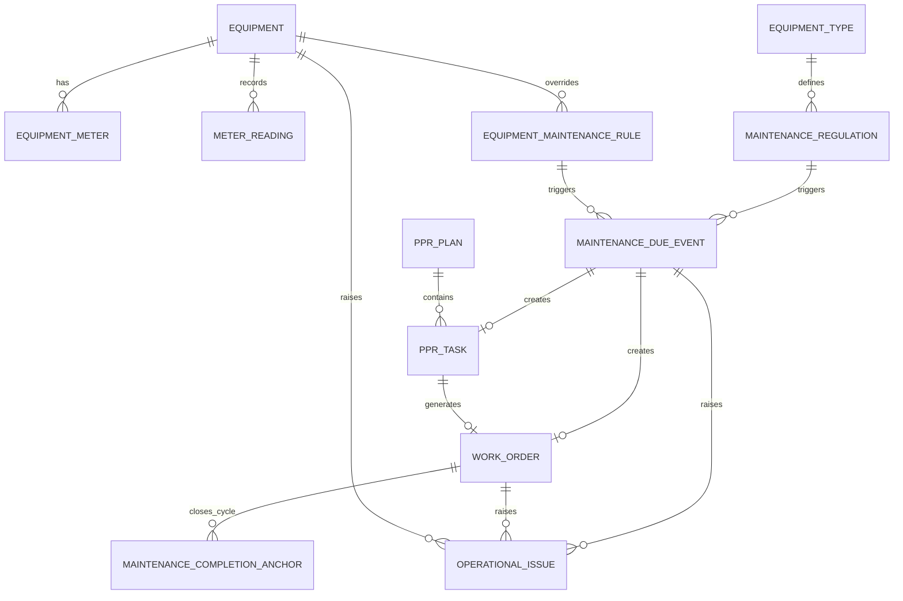
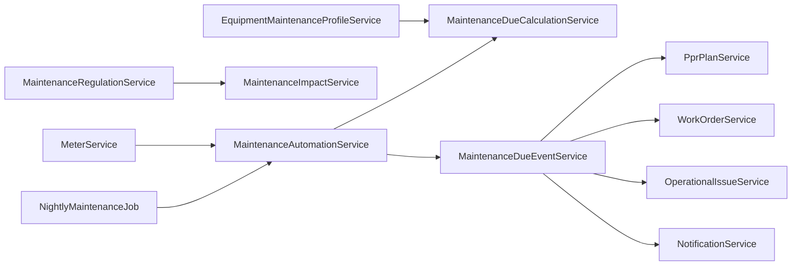
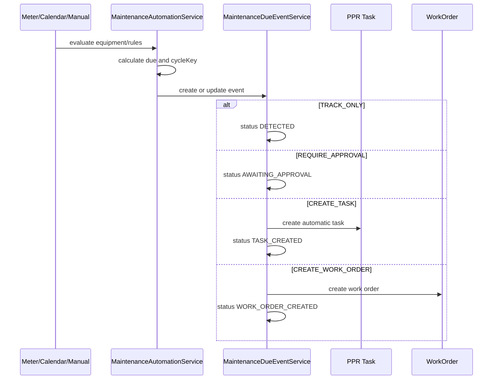

# Maintenance Automation Backend Analysis

Date: 2026-06-03
Branch: `ibrohim_backendchi`

## Frontend Compatibility Report

Frontend branch treated as contract: `feature/equipment-vehicle-documents`.

### Already Implemented

- Equipment document detail, presigned-url, download, delete endpoints exist:
  - `GET /api/v1/equipment/{id}/documents/{documentId}`
  - `GET /api/v1/equipment/{id}/documents/{documentId}/presigned-url`
  - `GET /api/v1/equipment/{id}/documents/{documentId}/download`
  - `DELETE /api/v1/equipment/{id}/documents/{documentId}`
- Equipment maintenance profile exists:
  - `GET /api/v1/equipment/{equipmentId}/maintenance-profile`
- Maintenance regulation CRUD exists:
  - `GET /api/v1/maintenance-regulations`
  - `GET /api/v1/maintenance-regulations/equipment`
  - `GET /api/v1/maintenance-regulations/{id}`
  - `POST /api/v1/maintenance-regulations`
  - `PUT /api/v1/maintenance-regulations/{id}`
  - `DELETE /api/v1/maintenance-regulations/{id}`
- Due calculation exists in `MaintenanceDueCalculationService`.
- PPR task generation exists for manual/generated PPR plans.
- Work order generation from approved PPR tasks exists.
- Meter reading creation exists in `MeterService.addReading()`.

### Missing

- Equipment documents list currently returns a plain list; frontend expects paginated response with `content`.
- Vehicle document endpoints are missing:
  - `GET /api/v1/vehicles/{vehicleId}/documents`
  - `GET /api/v1/vehicles/{vehicleId}/documents/{documentId}`
  - `GET /api/v1/vehicles/{vehicleId}/documents/{documentId}/download`
  - `DELETE /api/v1/vehicles/{vehicleId}/documents/{documentId}`
- Maintenance regulation preview:
  - `POST /api/v1/maintenance-regulations/preview`
- Maintenance regulation impact:
  - `GET /api/v1/maintenance-regulations/{id}/impact`
- Manual equipment recalculation:
  - `POST /api/v1/equipment/{equipmentId}/maintenance/recalculate`
- Due event workflow:
  - `GET /api/v1/maintenance-due-events`
  - `POST /api/v1/maintenance-due-events/{id}/approve`
  - `POST /api/v1/maintenance-due-events/{id}/cancel`
  - `POST /api/v1/maintenance-due-events/{id}/work-order`
- New regulation fields:
  - `automationAction`
  - `duplicatePolicy`
  - `leadTimeDays`
  - `leadMeterPercent`
  - `defaultDepartmentId`
  - `defaultResponsibleId`
  - `defaultPriority`
  - `requiresApproval`
  - `approvalRole`
  - `approvalPermission`
- Maintenance permissions:
  - `MAINTENANCE_REGULATION_READ`
  - `MAINTENANCE_REGULATION_CREATE`
  - `MAINTENANCE_REGULATION_UPDATE`
  - `MAINTENANCE_REGULATION_DELETE`
  - `MAINTENANCE_EVENT_READ`
  - `MAINTENANCE_EVENT_APPROVE`
  - `MAINTENANCE_EVENT_CANCEL`
  - `MAINTENANCE_AUTOMATION_RUN`
  - `MAINTENANCE_AUTOMATION_CONFIGURE`
- Equipment lifetime API fields:
  - `operationStartDate`
  - `expectedLifetimeMonths`
  - `expectedLifetimeYears`
  - `operatingDuration`
  - `expectedEndDate`
  - `remainingLifetime`
  - `lifetimeStatus`
- Unified `OperationalIssue` source for notification page.
- `DEPARTMENT_HEAD` role seed and default permissions.

### Partially Implemented

- Existing `MaintenanceDueCalculationService` returns due state, meter values, and blocking reasons, but it is read-only and does not create events, tasks, or work orders.
- Existing `PprGeneratorService` prevents duplicate PPR tasks by plan/regulation/equipment signature, but not by automation `cycleKey`.
- Existing `OverdueDetectorService` creates notifications and escalation events for overdue PPR/work orders, but there is no unified operational issue table.
- Existing PBAC department scope supports department-bound equipment, PPR plans, work orders, and notifications by recipient, but `DEPARTMENT_HEAD` role does not exist.
- Existing equipment lifetime has `averageOperatingLifeHours`, but not calendar lifetime fields/status.

### Incompatible

- Frontend document list uses `PaginatedResponse<TechnicalDocumentRecord>`, while backend equipment document list returns `List<EquipmentDocumentDto>`.
- Frontend expects vehicle documents under `/vehicles/...`; backend stores vehicle as equipment plus vehicle details and currently lacks vehicle document wrapper endpoints.
- Frontend defaults regulation automation to `REQUIRE_APPROVAL` and `ONE_ITEM_PER_CYCLE`; backend has no persistence for those defaults.
- Frontend due-event page expects nested `equipment` and `regulation` objects in event rows; backend has no event DTO.

## Impact Analysis

- Equipment: add lifetime fields, include calculated lifetime values in DTOs, trigger recalculation after relevant equipment changes.
- Vehicle: expose vehicle document endpoints by delegating to equipment document storage.
- Department: use existing `departmentId` and `responsibleDepartmentId` for scope. Department-scoped users must only access their department data.
- User/Role/Permission: add maintenance permissions and `DEPARTMENT_HEAD` defaults. `SYSTEM_ADMIN` and `*` remain bypasses.
- Meter/MeterReading: after successful reading save and meter update, call automation evaluation for the equipment.
- MaintenanceRegulation: add automation policy fields and preview/impact support.
- MaintenanceTemplate: required for automation actions that create tasks/work orders, but existing schema can be referenced by `templateId`.
- PprPlan/PprTask: keep manual PPR. Add automatic task generation via due events, with `cycleKey` protection.
- WorkOrder: generate work orders from due events using existing `WorkOrderService.create()` and link by created work order id in event.
- Notifications: keep existing notifications; operational issues become an additional unified source for problem lists.

## Entity Diagram

## Service Diagram

## Event Flow Diagram

## Migration Plan

1. Add automation columns to `maintenance_regulations`.
2. Create `maintenance_due_events` with indexes on `equipment_id`, `regulation_id`, `status`, `due_status`, `cycle_key`, `created_task_id`, and `created_work_order_id`.
3. Add lifecycle columns to `equipment`.
4. Add `maintenance_due_event_id` and `cycle_key` to `ppr_tasks` and `work_orders` if direct linking is required.
5. Create `operational_issues`.
6. Seed maintenance permissions and `DEPARTMENT_HEAD`.

## PPR Design Decision

- Current tasks require a `PprPlan`, so automatic tasks cannot safely exist without a plan unless the schema is changed.
- Safest design: keep manual plans unchanged and create/reuse a generated monthly `AUTO_MAINTENANCE` plan per department for automatic tasks.
- Work orders may still be created directly from events when `automationAction = CREATE_WORK_ORDER`; when a task is created first, the work order links to that task.
- `cycleKey` protects both automatic tasks and work orders from duplicate generation.

## Risks

- Work order creation currently requires client-style fields such as `createdById` and a unique number; automation must generate these deterministically and handle missing user context.
- Calendar rules without completion anchors currently become `BLOCKED`; this behavior is preserved unless an explicit initial schedule policy is added later.
- `DEPARTMENT_HEAD` must not weaken existing PBAC. Tests must cover list/read/mutation paths.
- Existing notification page is recipient-based. Operational issues can be added as a unified source without deleting old notifications.
- Large batch automation must isolate failures per equipment/regulation so one bad rule does not stop the nightly job.
